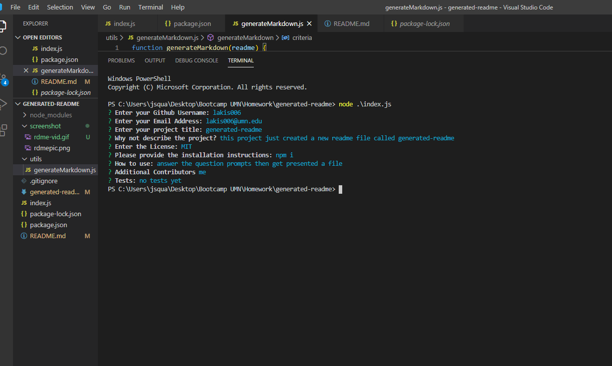

  # 

  ## Description
  The Generate Readme project is designed to help you build the most efficient and best readme there is! Once you enter all the prompt questions, you will be given a new read-me by the file name "generated-Readme"  
 
  # Utilization Video

  

  ## Link to deployed app 
    https://lakis006.github.io/generated-readme/

 ## Screenshot
   

  ## Tests
  dont test me 

  ## Questions
  Please direct any questions to lakis006@umn.edu

  ---

  
